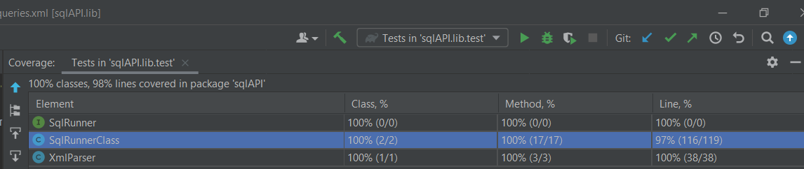

Submitter name: Tanmay Aeron\
Roll No.: 2019CSB1124\
Course: CS305 Software Engineering

<h1>What does this program do</h1>

   This program is a Java library which reads SQL query format from an XML file. It dynamically populates placeholders in it by value provided by an argument and then run the query.

   This library provides API of following signature:

```
   SqlRunnerClass(SqlRunnerClass.OpPrams  parameters)
```
API provides following endpoints:

```
  <T, R> R selectOne(String queryId, T queryParam, Class<R> resultType);
```

```
  <T, R> List<R> selectMany(String queryId, T queryParam, Class<R> resultType);
```
```
  <T> int insert(String queryId, T queryParam);
```
```
  <T> int update(String queryId, T queryParam);
```
```
  <T> int delete(String queryId, T queryParam);
```

selectOne returns an object of Class resultType.\
selectMany returns a List of objects of CLass resultType.\
insert, update and delete returns number of rows affected.

<h1>A description of how this program works (i.e. its logic)</h1>
    
   This library implements two classes:
   1. XmlParser
   
      XmlParser returns ArrayList of nodes represented by hashmaps. HashMap contains attributeNames as key and value corresponding to that as value.
      Apart from that there is key named "textContent" which has text content of nodes.
   
   2. SqlRunnerClass
   
      XML file whose path is provided is first loaded and the query with unique id provided is fetched.
      This query is named as queryFormat.  Whether paramType provided in XML and type of queryParam matches is checked. After that ${} fields are populated with values provided in queryParam. This query is executed on database whose connection is provided by user.In case of select queries result is populated into an object of type resultType by matching column names with field names of object.
   
   <h3>Usage</h3>
   
   
   ```
   
   con = DriverManager.getConnection(url,user,password);
   SqlRunnerClass.OpPrams opp = new SqlRunnerClass.OpPrams();
   opp.con = con;
   opp.filePath = "queries.xml";
   opp.tagName = "sql";
   opp.uniqueAttributeName = "id";
   opp.paramTypeAttributeName = "paramType";
   SqlRunner sqlExecuter = new SqlRunnerClass(opp);
   
   ```   

   con is connection to database.\
   filePath is path of XML file.\
   tagName is tag in which queries will be present.\
   uniqueAttributeName is name of attribute whose value is unique for every query and hence is used for identifying query.\
   paramTypeAttribute is name of attribute which has value of FQN of Class of object queryParam.

   One example of using an API endpoint is as follows:\
   
   XML file:

   ```
   <queries>
    <sql id="getName" paramType="java.lang.Integer">
        <![CDATA[
        SELECT first_name,last_name from actor WHERE actor_id=${actorId};
        ]]>
    </sql>
    </queries>
   ```
   
   API Call:
   ```
   class Name {
      public string first_name;
      public string last_name;
   }
   int actorId = 1;
   Name name   = sqlExecuter.selectOne("getName",actorId,Name.class);
   ```

   
   Note:

>1. FQN of class queryParam should match with paramType in SQL 
>2. Fields of class of POJO should match with column name returned by sqlQuery in case of select queries.
>3. In case of queryParam object, ${} fields are populated in following way:\
>     i) null: nothing is substituted in query.\
>     ii) String/Char/Date: then it is expected that there would only be one placeholder and will be replaced by " ' "+object.toString()+" ' "\
>     iii) primitiveWrapper apart from java.lang.Character: its value will be substituted in only one placeholder\
>     iv) Array/Collection: value of elements separated by , enclosed within () is replaced.\
>     v) Objects: its fields are matched with text written inside placeholder in query and is replaced by field's value\
>     vi) If elements of Array/elements of Collection/field of object is an object apart from primitiveWrapper/String/Char/Date, user should properly override toString function of that object(Class).

   
   
   


<h1>How to compile and run this program</h1>
  
   <h3>Prerequisite</h3>
   This library is build using Java and gradle.\
   For running unit tests given, edit the path to connection,userName and password.
   sakila database which is available at https://dev.mysql.com/doc/sakila/en/  should be installed.

   <h3>How to run</h3>
   First clone the repository with the following command:
   
   ```
   git clone https://github.com/tanmayaeron/cs305_2022
   ```
   Navigate into Assignment1 directory\
   Build the project with the following command: 
   ```
   gradle build
   ```
   For running unit tests, execute following command:
   ```
   gradle test
   ```

<h1>Code Coverage</h1>




   
    

   


