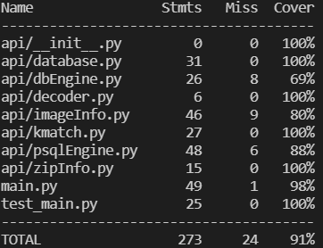

Submitter name: Tanmay Aeron

Roll No.: 2019CSB1124

Course: CS305 Software Engineering

=================================

<h1> What does this program do</h1>

   This program implements an api that can be used to do facial-search on a database of images.It provides following endpoints which can be invoked by sending HTTP post request. 

   ```
   @app.post("/search_faces/")
   async def search_faces(file: UploadFile = File(...),k: str=Form(...),tolerance: str=Form(...))

   @app.post("/add_face/")
   async def add_face(file: UploadFile = File(...,description="An image file having a single human face."))

   @app.post("/add_faces_in_bulk/")
   async def add_faces_in_bulk(file: UploadFile = File(...,description="A ZIP file containing multiple face images."))

   @app.post("/get_face_info/")
   async def get_face_info(api_key: str = Form(...),face_id: str=Form(...))
   ```


<h1> A description of how this program works (i.e. its logic)</h1>


This program uses FastAPI Framework for developing this API.\
For database,There is an abstract class DBEngine and a class PSQLEngine which extends this class and contains implementation of CRUD operations for PSQL. DBEngine class can be extended easily for other relational-database engines.\
Whenever a user, sends a file for adding to database, first step is to get encoding for that image.For this purpose, image_recognition library is used. Next step is to extract metadata from the image.Name,Version,Date and Place tags are searched in metadata.If Name tag is not present,it is set to filename(without extension).Others if not present are set to 'NA'. In case of zipfile, multiprocessing is used to get encoding of images to make the process fast.\
In order to search for images, first of all, image encoding for every face in image is fetched.Then, encoding for every image in database is fetched. After that, top-k matches for every face is returned provided they have distance(as defined in face_recognition) less than tolerance.


<h1> How to compile and run this program</h1>

<h2>Requirements</h2>

   python>=3.7\
   pip>=20.0.0\
   postgresql server

<h3>Librarires</h3>

[face_recognition](https://github.com/ageitgey/face_recognition.)\
psycopg2-binary\
pytest\
coverage\
fastapi\
uvicorn[standard]

<h2>How to run</h2>
   Edit config.json file appropriately.

   Make sure databasae mentioned in config.json is already created.\
   In the database, there should not be any relation.

   Run the database server by the following command:(may vary for different systems):
   ```
   sudo service postgresql start
   ```

   For running server, enter following command:
   ```
   python3 main.py 
   ```

   For running test cases, enter the following command: 
   ```
   python3 -m coverage run --source=. -m pytest
   ```

   See coverage by following command:
   ```
   python3 -m coverage report
   ```

 Note:

> If the above commands do not run, try replacing python3 with python


<h1> Coverage Report</h1>

