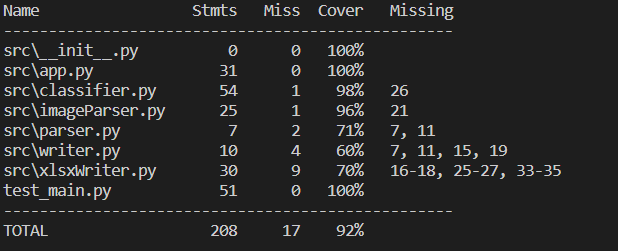

Submitter name: Tanmay Aeron

Roll No.: 2019CSB1124

Course: CS305 Software Engineering

=================================

<h1> What does this program do</h1>
This program extracts text from different book covers and with the help of this text try to extract different information about book like its title,author,publisher and ISBN number and write this information to a ".xlsx" file.

<h1> A description of how this program works (i.e. its logic) </h1>

This program parse given image file  with the help of external OCR library and gets text with its height.

An abstract class Parser has been made so that it can be extended to support other types of files.

Writer class is an abstract class and has been extended by XlsxWriter class which provides functionality to write to a .xlsx file.

Classifier class takes text with metadata about text and extracts title,author, publisher,isbn from it using different heuristics.It has been assumed that title will have largest text size.

<h1>How to compile and run this program</h1>

Install tesseract and modify tesseractpath.txt file by writing path to tesseract in it.

Run following command:

    pip install -r requirements.txt

If you want to run program on single file, run following command:

    python main.py filePath

If you want to run program on folder, run the following command:

    python main.py -d folderPath

To run test,run the following command:

    python -m coverage run --source=. --omit=main.py -m pytest

To see coverage report, run the following command:

    coverage report 

<h1>Coverage Report</h1>

